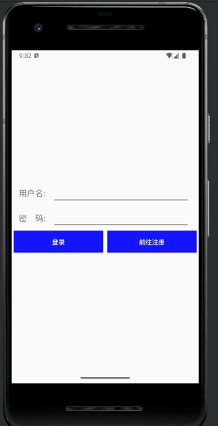
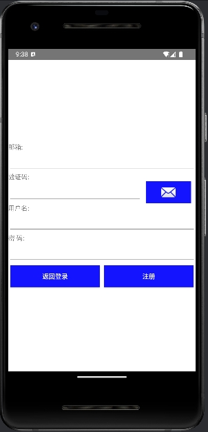

## PKUToDo前端部分
### 开发工具
| 工具             | 版本        |说明     | 官网                                            |
|----------------|-----------|--------| ----------------------------------------------- |
| Android Studio | 2024.1.2  | 开发IDE       |   https://developer.android.com/studio?hl=zh-cn    |
| gradle         | 8.7       | 项目构建工具 |   https://gradle.org/releases/      |

### 开发环境
| 工具           | 版本号                           | 下载                                                 |
|--------------|-------------------------------|----------------------------------------------------|
| JDK          | 17                            | https://www.oracle.com/java/technologies/downloads/ |
| Pixel 2 虚拟设备 | Android API 35 x86-64 | 直接在Android Studio-右侧工具栏Device Manager下载            |                                            |


### 项目结构
```plaintext
app/src/main/: 项目主目录
├── res
├── java.edu.pku.pkutodofrontend
│   ├── activity
│   │   ├── MainActivity.java 登录界面
│   │   ├── RegisterActivity.java 注册界面
│   │   └── WelcomeActivity.java  hello world界面
│   ├── utils 工具类
├── res
│    ├── drawable 图形资源目录
│    ├── layout 布局文件目录
│    ├── values 值资源目
│    ├── xml 其他配置目录
...
   
```


### Done
- 登录和注册界面的制作，效果如下，很简陋，实现了基本的交互流程





### ToDo
- 登录注册界面的美化
- Activity中的代码比较冗长，可能需要对重用代码进行封装，比如构造请求、弹出提示框等


